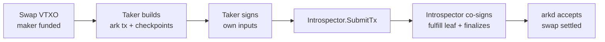

# Banco Swap Protocol V1 Specification (Working Draft)

## 1. Overview

The Banco swap is a non-interactive, atomic asset swap projected onto the
Arkade virtual mempool. A **maker** publishes a standing offer by funding a
VTXO whose script encodes "pay me `WantAmount` of `WantAsset` and you may sweep
the deposit". A **taker** (the `bancod` solver bot) watches arkd's transaction
stream, recognises offers it is configured to fill, and settles them with a
single Ark transaction. Settlement is atomic: the maker receives its requested
output or the swap VTXO is never spent.

The protocol relies on three parties:

-   The **maker** funds the swap VTXO and never needs to be online again. The
    offer is fully described on-wire; no maker signature is required to fulfil
    it.
-   The **taker** spends the swap VTXO via its **fulfill** tapscript, providing
    the maker's output and its own change in the same transaction.
-   The [**introspector**](https://github.com/ArkLabsHQ/introspector) is the
    covenant-enforcing co-signer. The fulfill leaf
    delegates one of its two required keys to a key that is tweaked by the
    fulfill script itself, so the introspector will only sign a transaction
    whose outputs satisfy that script. This is what makes the swap trustless for
    the maker.

The offer rides in the funding transaction's
[Arkade extension](https://github.com/arkade-os/arkd/blob/master/pkg/ark-lib/extension/README.md)
OP_RETURN, and asset legs are tracked by the
[Arkade Asset packet](https://github.com/ArkLabsHQ/arkade-assets/blob/master/arkade-assets.md).
Both are existing Ark features and are not re-specified here. What is new — and
what this document covers — is the **offer packet** and **how it is used**: the
offer encoding, the swap VTXO taproot tree, and the fulfillment transaction. It
does **not** specify the bot's acceptance policy beyond Section 5.2; that is
operator configuration, not consensus.

## 2. Offer packet (type `0x03`)

The offer is attached to the funding transaction as a single Arkade-extension
packet of **type `0x03`**. The extension and its framing (magic bytes, push
encoding, per-packet length) are an existing Ark feature documented in the
[extension README](https://github.com/arkade-os/arkd/blob/master/pkg/ark-lib/extension/README.md);
this section specifies only the `0x03` payload.

A funding transaction MUST contain at most one Type `0x03` record. A consumer
that finds none treats the transaction as "not a Banco offer" and ignores it.

The payload is a flat stream of TLV records with **fixed 2-byte big-endian
length framing**, parsed sequentially by type:

```
TLV_Record := Type(1 byte) || Length(u16 BE) || Value[Length]
```

-   Records are parsed sequentially until the payload is exhausted.
-   An unknown `Type` is **rejected** (the offer is malformed), not skipped.
    Offers are not forward-extensible at this layer in V1.
-   A truncated header or value renders the offer INVALID.

### 2.1. Fields

```
Offer := {
  0x01 SwapPkScript        : bytes        # REQUIRED. pkScript of the swap output.
  0x02 WantAmount          : u64 BE       # REQUIRED. Amount the maker wants to receive.
  0x03 WantAsset?          : AssetId       # absent => BTC. Asset the maker wants.
  0x04 CancelAt?           : u64 BE       # unix timestamp; absent/0 => no cancel path.
  0x05 MakerPkScript       : bytes(34)    # REQUIRED. OP_1 || PUSH32 || <32-byte key>.
  0x07 MakerPublicKey?     : xonly(32)    # REQUIRED iff CancelAt or ExitDelay is set.
  0x08 IntrospectorPubkey  : xonly(32)    # REQUIRED. Covenant co-signer key.
  0x09 RatioNum?           : u64 BE       # partial-fill numerator; absent/0 => unset.
  0x0a RatioDen?           : u64 BE       # partial-fill denominator; absent/0 => unset.
  0x0b OfferAsset?         : AssetId       # absent => BTC. Asset deposited into the swap.
  0x0c ExitDelay?          : ExitTimelock # maker's relative-locktime exit path.
}

ExitTimelock := { type: u8, value: u64 BE }       # type 0x00 = blocks, 0x01 = seconds
```

`AssetId` is the Arkade Asset identifier `(genesis_txid, group_index)` defined by
the [Arkade Asset spec](https://github.com/ArkLabsHQ/arkade-assets/blob/master/arkade-assets.md).

**Required fields:** `SwapPkScript`, `WantAmount`, `MakerPkScript`,
`IntrospectorPubkey`. An offer missing any of these is INVALID.

**Serialization order.** A serializer MUST emit present records in this order:
`SwapPkScript`, `WantAmount`, `WantAsset?`, `RatioNum?`, `RatioDen?`,
`OfferAsset?`, `CancelAt?`, `MakerPkScript`, `MakerPublicKey?`,
`IntrospectorPubkey?`, `ExitDelay?`. Parsers MUST NOT assume this order — the
stream is parsed by `Type` — but emitting it canonically keeps offer hashes
stable across implementations.

### 2.2. Encoding details

-   **Byte order.** All scalar integer fields (`WantAmount`, `CancelAt`,
    `RatioNum`, `RatioDen`, `ExitTimelock.value`) are **big-endian** u64 (8
    bytes), following the convention of the reference ts-sdk.
-   **`MakerPkScript`** MUST be exactly 34 bytes and a well-formed taproot
    program: `OP_1 (0x51) || OP_DATA_32 (0x20) || <32-byte witness program>`.
    The trailing 32 bytes are the maker's witness program, reused as
    `makerWitnessProgram` in the fulfill script.
-   **Public keys** (`MakerPublicKey`, `IntrospectorPubkey`) are 32-byte x-only
    Schnorr keys. `IntrospectorPubkey` MUST be exactly 32 bytes.
-   **`WantAsset` / `OfferAsset`** are serialized `AssetId`s; their absence means
    the leg is native BTC.
-   **`ExitTimelock`** is 9 bytes: a 1-byte locktime type (`0x00` block height,
    `0x01` seconds) followed by an 8-byte big-endian value.

## 3. Swap VTXO taproot tree

The swap address is the taproot output the maker funds. Its tree is derived
deterministically from the offer plus the Ark **signer** key, so any party can
reconstruct it from the offer payload alone. The taker MUST verify the
reconstructed swap pkScript equals the offer's `SwapPkScript` before spending.

```
TapscriptsVtxoScript {
  Closures[0] = MultisigClosure{ SignerPubKey, FulfillTweakedKey }      # REQUIRED
  Closures[1] = CLTVMultisigClosure{ {MakerPublicKey, SignerPubKey}, CancelAt }   # iff CancelAt
  Closures[2] = CSVMultisigClosure{  {MakerPublicKey, SignerPubKey}, ExitDelay }  # iff ExitDelay
}
```

### 3.1. Fulfill closure

The first (and only mandatory) leaf is a 2-of-2 between the Ark **signer** and a
**tweaked introspector key**:

```
FulfillTweakedKey = ComputeArkadeScriptPublicKey(
                        IntrospectorPubkey,
                        ArkadeScriptHash(FulfillScript))
```

Because the second key commits to `FulfillScript`, the introspector's signature
is only obtainable for a transaction whose outputs satisfy that script. This is
the covenant that protects the maker.

### 3.2. Fulfill script

`FulfillScript` is an Arkade-script (introspection opcodes) the introspector
evaluates against the spending transaction. It pins **output[0]** to the maker.

**BTC swap** (`WantAsset` absent):

```
OP_0 OP_INSPECTOUTPUTVALUE <WantAmount> OP_GREATERTHANOREQUAL OP_VERIFY
OP_0 OP_INSPECTOUTPUTSCRIPTPUBKEY OP_1 OP_EQUALVERIFY <makerWitnessProgram> OP_EQUAL
```

i.e. output[0].value ≥ `WantAmount` AND output[0] is the maker's taproot script.

**Asset swap** (`WantAsset` present):

```
OP_0 <WantAsset.txid> OP_0 OP_INSPECTOUTASSETLOOKUP OP_VERIFY
<WantAmount> OP_GREATERTHANOREQUAL OP_VERIFY
OP_0 OP_INSPECTOUTPUTSCRIPTPUBKEY OP_1 OP_EQUALVERIFY <makerWitnessProgram> OP_EQUAL
```

`OP_INSPECTOUTASSETLOOKUP` consumes `(output_index=0, txid, lookup_index=0)`,
pushes `(success_flag, amount)`; `OP_VERIFY` asserts the asset was found, then
the amount and scriptPubKey checks run as above. The asset group the taker emits
for `WantAsset` MUST therefore sit at group index 0 of the fulfillment
transaction's asset packet (Section 4.2).

### 3.3. Cancel and exit closures (optional)

-   **Cancel** (`CancelAt` set): a `CLTVMultisigClosure` of
    `{MakerPublicKey, SignerPubKey}` spendable after the absolute locktime
    `CancelAt`. Lets the maker reclaim the deposit if no taker fills the offer.
-   **Exit** (`ExitDelay` set): a `CSVMultisigClosure` of the same keys with a
    relative locktime, for the maker's unilateral-exit path.

Both require `MakerPublicKey` (record `0x07`); an offer that sets `CancelAt` or
`ExitDelay` without it is INVALID.

> Note: V1 of `bancod`'s maker helper does not yet construct cancel/exit
> offers (`CreateOffer` rejects them), but the wire format and tree support
> them for forward compatibility.

## 4. Fulfillment transaction

The taker spends the swap VTXO through the fulfill leaf, satisfying the covenant
in the same Ark transaction. Build via the standard Ark off-chain path
(checkpoint + ark tx).

### 4.1. Input / output layout

```
Inputs:
  vin 0      : swap VTXO (spent via the fulfill closure + control block)
  vin 1..N   : taker VTXOs (spent via their forfeit closures), funding the maker payment + fees

Outputs:
  vout 0     : maker payment      — value = WantAmount (BTC) | 330 sat dust carrier (asset)
                                     pkScript = MakerPkScript
  vout 1     : taker output       — swap deposit + BTC change (+ asset change)
                                     pkScript = taker's offchain address
  vout 2     : OP_RETURN extension — introspector packet (+ asset packet if any)
```

When `WantAsset` is set, output[0] carries a 330-sat dust BTC carrier and the
asset itself is routed through the asset packet; otherwise output[0] carries
`WantAmount` BTC directly. BTC change is merged into the taker output to avoid
sub-dust outputs.

### 4.2. Introspector and asset packets

The fulfillment transaction's OP_RETURN extension carries:

1.  An **introspector packet**: `IntrospectorEntry{ Vin: 0, Script: FulfillScript }`.
    This tells the introspector which input (the swap VTXO) is gated by which
    Arkade-script, so it can evaluate the covenant before co-signing.
2.  An **[Arkade Asset packet](https://github.com/ArkLabsHQ/arkade-assets/blob/master/arkade-assets.md)**
    (only when assets move), tracking every asset across inputs and outputs.
    Banco's usage constraint: the wanted asset group MUST be at group index 0
    (the fulfill script's `OP_INSPECTOUTASSETLOOKUP` uses `lookup_index = 0`).
    Maker-bound asset amounts go to vout 0; all remaining asset balance goes to
    the taker (vout 1).

### 4.3. Signing and finalization



The taker signs the ark transaction and pre-signs every checkpoint with its own
key. Because the fulfill closure makes the **introspector's tweaked key the last
non-arkd signer**, the introspector takes the finalizer role: it verifies the
covenant, adds its signature, forwards to arkd, merges arkd's checkpoint
signatures, and returns the finalized ark transaction. The returned ark txid is
the settlement identifier.

## 5. Validation rules

### 5.1. Protocol validation (any consumer)

-   **TLV well-formedness**: every record fits within the payload; no truncated
    headers or values; no unknown `Type`.
-   **Required fields present**: `SwapPkScript`, `WantAmount`, `MakerPkScript`,
    `IntrospectorPubkey`.
-   **`MakerPkScript`** is exactly 34 bytes and a valid P2TR program.
-   **`IntrospectorPubkey`** is a valid 32-byte x-only key.
-   **Tree consistency**: the swap pkScript reconstructed from the offer +
    signer key MUST equal `SwapPkScript`. A taker MUST abort fulfillment on
    mismatch (`offer inconsistency`).
-   **Swap output exists**: the funding transaction MUST contain an output whose
    pkScript equals `SwapPkScript` with value > 0. Its value (or the asset
    amount from the colocated asset packet output) is the deposit.

### 5.2. Taker acceptance policy (bot configuration)

These gates are **not** consensus; they are the operator's risk policy. A taker
MAY apply any subset. `bancod` applies, in order:

-   **Pair match**: a configured trading pair MUST exist for the offer's
    `(DepositAsset → WantAsset)` direction. Otherwise the offer is ignored.
-   **Amount in range**: `WantAmount ∈ [MinAmount, MaxAmount]` for the pair.
-   **Price tolerance**: the offer price (deposit/want, decimal-adjusted) MUST be
    within **±1%** of the configured price feed mid. A stale feed logs a warning
    but does not auto-reject; an unavailable feed rejects.
-   **Solvency**: if the want leg is BTC, the taker's off-chain balance MUST be
    ≥ `WantAmount`. Asset wants skip this check.

An offer that fails any gate is silently dropped, not rejected on-chain — the
swap VTXO simply remains unspent and available to another taker.

## 6. Maker lifecycle

-   **Create.** The maker calls `CreateOffer(WantAmount, WantAsset, …)`: it
    fetches the introspector's signer key, derives the maker pkScript from its
    Ark address, builds the `Offer`, computes the swap address from the VTXO
    tree, and returns the hex offer payload + extension packet + swap address.
    The maker then funds the swap address, attaching the offer packet to the
    funding transaction's extension.
-   **Monitor.** `GetOffers(swapAddress)` queries the indexer for VTXOs at the
    swap address, returning `{txid, vout, value, spendable}` per offer so the
    maker can tell whether its offer is still live or has been filled.
-   **Reclaim.** If the offer carried a cancel/exit path, the maker can reclaim
    the deposit after the locktime via the corresponding closure.

## 7. Rationale and notes

-   **Why a tweaked introspector key, not the maker's signature?** It makes the
    offer non-interactive. The maker funds once and goes offline; the covenant —
    not a live signature — guarantees it gets paid. Anyone can be the taker.
-   **Why output[0] is pinned by index.** The fulfill script self-references
    `output[0]` rather than searching, keeping the introspection script small
    and the asset lookup deterministic (`lookup_index = 0`).
-   **Partial fills.** `RatioNum`/`RatioDen` reserve the wire space for
    partial-fill offers. They are decoded but not yet enforced by the V1 fulfill
    path, which fills the whole deposit.
