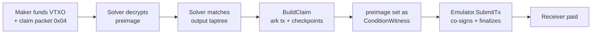

# Preimage Claim Protocol V1 Specification (Working Draft)

## 1. Overview

The Preimage Claim protocol lets a **maker** lock a VTXO behind a hash preimage
and hand that preimage — confidentially — to a **solver bot**, so the bot
sweeps the VTXO to a designated receiver the moment the funding transaction is
broadcast. It is the building block for HTLC-style flows (e.g. a swap leg that
must be claimed with knowledge of a secret) where the secret-holder does not
want to stay online to claim.

The protocol is deliberately **stateless** on the solver side:

-   The maker fetches the solver's encryption public key once
    (`GetSolverPubKey`), ECIES-encrypts the 32-byte preimage to it, and attaches
    the ciphertext plus the plaintext receiver script to the funding
    transaction's Arkade extension.
-   The solver watches arkd's transaction stream, decrypts on the fly, validates
    the funding output's taptree against the encrypted material, and claims.
-   There is **no registration, no database, no per-claim persistence**. The bot
    can be restarted at any time; nothing is lost because nothing is stored.

The claim rides in the funding transaction's
[Arkade extension](https://github.com/arkade-os/arkd/blob/master/pkg/ark-lib/extension/README.md)
OP_RETURN — an existing Ark feature, not re-specified here. What is new — and
what this document covers — is the **claim packet** and **how it is used**: the
packet encoding, the ECIES scheme, the Arkade enforcement script, the covenant
claim closure, and the claim transaction. V1 supports exactly one
receiver-script shape: `EnforcePayTo` (single output, full amount to one
receiver).

## 2. Claim packet (type `0x04`)

A maker publishes a claimable VTXO by funding a taproot output whose tree
contains a covenant claim closure (Section 4), and by attaching the claim packet
to the funding transaction's
[Arkade extension](https://github.com/arkade-os/arkd/blob/master/pkg/ark-lib/extension/README.md)
OP_RETURN as a single packet of **type `0x04`**. The extension and its framing
are an existing Ark feature documented there; this section specifies only the
`0x04` payload.

Crucially, the **taptree does not ride in the packet**. It travels in the
funding output's PSBT field `POutput.TaprootTapTree` (BIP-371). The packet
carries only the ciphertext and the plaintext arkade script; the solver
recovers the tree from the output itself and cross-checks it.

The payload is a flat TLV stream with **2-byte big-endian length framing**,
identical in shape to the Banco offer codec:

```
TLV_Record := Type(1 byte) || Length(u16 BE) || Value[Length]

ClaimPacket := {
  0x01 Ciphertext   : bytes   # REQUIRED. ECIES(solverPub, 32-byte preimage).
  0x02 ArkadeScript : bytes   # REQUIRED. Plaintext EnforcePayTo(receiverPk) bytes.
}
```

-   Both records are REQUIRED; a packet missing either is INVALID.
-   `Ciphertext` MUST be non-empty; `ArkadeScript` MUST be non-empty.
-   A truncated header or value renders the packet INVALID. Unknown record types
    encountered while parsing are skipped (the two known types are extracted by
    `Type`).

## 3. ECIES encryption scheme

`Ciphertext` is the 32-byte preimage sealed to the solver's public key using
ECIES over secp256k1.

### Wire layout

```
Ciphertext := ephemeralPub(33) || nonce(12) || AEAD_output
```

-   `ephemeralPub`: compressed secp256k1 point (33 bytes) of a fresh per-message
    ephemeral key.
-   `nonce`: 12 random bytes (AES-GCM nonce).
-   `AEAD_output`: `AES-256-GCM.Seal(plaintext)` including the 16-byte tag.
-   Fixed overhead: 33 + 12 + 16 = **61 bytes**; for a 32-byte preimage the
    ciphertext is 93 bytes.

### Key derivation

```
shared    = ECDH(ephPriv, solverPub).X            # 32-byte X coordinate
symKey    = HKDF-SHA256(ikm = shared,
                        salt = ephemeralPub,        # the 33-byte compressed point
                        info = "solverd/preimage/v1",
                        len  = 32)
AEAD      = AES-256-GCM(symKey), AAD = ephemeralPub
```

The ephemeral public key is bound twice — as the HKDF salt and as the AEAD
additional-authenticated-data — so the ciphertext cannot be replayed under a
different ephemeral point. Decryption mirrors this exactly; a wrong key, tampered
blob, or tag mismatch fails closed.

## 4. Arkade enforcement script and claim closure

### 4.1. EnforcePayTo

The plaintext arkade script carried in the packet pins the claim's output to the
intended receiver. For a 34-byte P2TR `receiverPkScript`
(`OP_1 || PUSH32 || <witnessProgram>`):

```
OP_PUSHCURRENTINPUTINDEX OP_DUP
OP_INSPECTOUTPUTSCRIPTPUBKEY OP_1 OP_EQUALVERIFY
<receiverWitnessProgram> OP_EQUALVERIFY
OP_INSPECTOUTPUTVALUE
OP_PUSHCURRENTINPUTINDEX OP_INSPECTINPUTVALUE
OP_GREATERTHANOREQUAL
```

The script self-derives the output index from the current input index `i`,
pinning `output[i]` to `receiverPkScript` and asserting
`output[i].value ≥ input[i].value`. It takes **no witness argument**.

### 4.2. Covenant claim closure

The funding output's taptree MUST contain a `ConditionMultisigClosure`:

```
ConditionMultisigClosure {
  MultisigClosure { ServerPubKey, EmulatorTweakedKey }
  Condition       : OP_HASH160 <RIPEMD160(SHA256(preimage))> OP_EQUAL
}

EmulatorTweakedKey = ComputeArkadeScriptPublicKey(
                            EmulatorPubKey,
                            ArkadeScriptHash(EnforcePayTo))
```

-   The 2-of-2 multisig binds the Ark **server** key and a **tweaked
    [emulator](https://github.com/ArkLabsHQ/emulator)** key. The tweak
    commits to the exact `EnforcePayTo` script, so
    the emulator co-signs only a transaction that pays the receiver.
-   The `Condition` is satisfied by revealing a witness preimage whose HASH160
    matches — i.e. the secret the maker encrypted.

The closure may sit in a taptree alongside any other leaves the maker wants
(refund paths, escape hatches); the solver locates the claim leaf by matching
the `(ServerPubKey, EmulatorTweakedKey)` key pair.

## 5. Claim transaction

When the solver matches a funding output, it builds and submits an Ark
transaction that spends the VTXO through the claim closure.



### 5.1. Layout

```
Inputs:
  vin 0  : the preimage-gated VTXO, revealing the ConditionMultisigClosure
           script + control block. ConditionWitnessField = decrypted preimage.

Outputs:
  vout 0 : receiver payment — value = VTXO amount, pkScript = receiverPkScript
  vout 1 : OP_RETURN extension — emulator packet carrying the plaintext arkade script
```

-   The decrypted preimage is set as the `ConditionWitnessField` on input 0 of
    the ark transaction **and** of every checkpoint transaction.
-   The emulator packet is `EmulatorEntry{ Vin: 0, Script: EnforcePayTo }`,
    telling the emulator which Arkade-script gates the input.

### 5.2. Signing and finalization

The solver b64-signs the ark transaction and every checkpoint with its Ark
wallet key (the server-key half of the multisig), then calls the emulator's
`SubmitTx`. The emulator evaluates `EnforcePayTo`, adds its tweaked-key
signature, finalizes, and returns the finalized ark txid. Build failures are
logged and the claim is dropped — there is no retry.

## 6. Validation rules

A solver MUST treat each of the following as a silent skip (the transaction is
simply not a claim for it); none are on-chain rejections.

-   **Packet present**: the extension contains a Type `0x04` record decodable as
    a `ClaimPacket` with both TLVs.
-   **Decryptable**: `Decrypt(solverPrivKey, Ciphertext)` succeeds and yields
    exactly **32 bytes**. A ciphertext encrypted to a different solver key fails
    here and is skipped.
-   **Arkade script shape**: `ArkadeScript` MUST be byte-identical to
    `EnforcePayTo(receiver)` for exactly one `OP_DATA_32` receiver witness
    program. Any other shape is rejected (V1 supports only `EnforcePayTo`).
-   **Taptree binding**: some funding output MUST have:
    -   a non-empty `POutput.TaprootTapTree` decodable as a
        `TapscriptsVtxoScript`;
    -   a `ConditionMultisigClosure` whose two keys are exactly
        `(ServerPubKey, EmulatorTweakedKey(ArkadeScript, EmulatorPubKey))`
        (compared by x-only Schnorr serialization);
    -   a `PkScript` equal to the P2TR derived from that taptree.
-   **Spendable**: the funding VTXO MUST be currently spendable for the matched
    script (`GetVtxos(WithScripts, WithSpendableOnly)` returns it). A VTXO not
    yet (or no longer) spendable is skipped.

## 7. Key management

-   **Solver encryption key.** The solver's ECIES key is derived deterministically
    from the wallet seed: `HMAC-SHA256(seed, "solverd/preimage-plugin/v1")`
    interpreted as a secp256k1 private key. It is stable across restarts as long
    as the seed is unchanged, which is what makes the protocol stateless — a
    maker that fetched the key yesterday can still encrypt to it today.
-   **`GetSolverPubKey` RPC.** Makers fetch the compressed solver public key over
    the bot's gRPC/REST API before encrypting. The same surface exposes the
    emulator public key so the maker can compute `EmulatorTweakedKey`
    and build the covenant closure.

## 8. Rationale and limitations

-   **Why ECIES instead of putting the preimage on-chain?** The preimage is the
    secret. Publishing it would let anyone claim. Encrypting to the solver makes
    the bot the only party that can spend, while keeping the funding transaction
    public.
-   **Why the taptree lives in the output, not the packet.** The funding output
    already commits to its taptree via BIP-371; duplicating it in the packet
    would bloat the OP_RETURN and create a consistency hazard. The solver derives
    the expected P2TR from the tree and matches it against the output's
    `PkScript`, so a forged tree cannot fool it.
-   **Why the tweaked emulator key.** It is the covenant that forces the
    claim to pay the intended receiver. Without it, a solver holding the preimage
    could redirect funds; with it, the emulator refuses to co-sign anything
    but `EnforcePayTo(receiver)`.
-   **V1 scope.** Only `EnforcePayTo` (single output, full amount to one
    receiver) is accepted. Multi-output splits, partial claims, and alternative
    enforcement shapes are out of scope for V1 and would extend Section 4.1 with
    new validated arkade-script forms.
